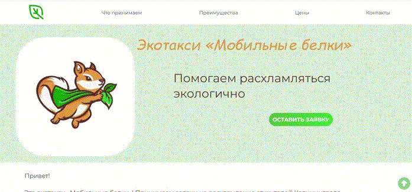

# 🌱🐿️Сайт экотакси «Мобильные Белки»

Сайт предлагает сервис вывоза ненужных вещей, чтобы не выкидывать всё на мусорные полигоны, а пристраивать то, что можно пристроить и сдавать в переработку.

## 📖О сайте
<p>Заказчик - две экоактивистки из Калининграда.<br>
На сайте представлена информация о сервисе с возможностью оформить заявку для вывоза, а также оставить отзыв и получить приятный подарок.
</p>



## 🔑Особенности

- 🚕 **Знакомство**: Информация о сервисе и его главных ценностях.
- 👫 **Для кого**: Кому подойдет сервис.
- 🐾  **О команде**: Знакомство с экоактивистками.
- 📝 **Отзывы**: Возможность оставить отзыв и ознакомиться с уже существующими.
- 🧹 **Подготовка к вывозу**: Что нужно сделать, чтобы подготовиться к вывозу.
- 🎁 **Подарок**: Предлагается бесплатный гайд за подписку на соц.сети.
- 💥 **Адаптивный дизайн**: Сайт полностью адаптивен под любые устройства.
- 📞 **Контактная информация**: Доступ к контактным данным и ссылкам на социальные сети.

## 💡 Технологии

-   **HTML5 & CSS3**: Для структурирования и стилизации сайта.
-   **JavaScript**: Для слайдера отзывов.

## ⚙️Установка

Чтобы запустить этот проект локально, выполните следующие действия:

1. Клонируйте репозиторий:

    ```bash
    git clone https://github.com/AnyaLap/belki.git
    ```

2. Перейдите в каталог проекта:

    ```bash
    cd belki
    ```

3. Откройте `index.html` в предпочитаемом вами веб-браузере.

---

## 👥 Участники


